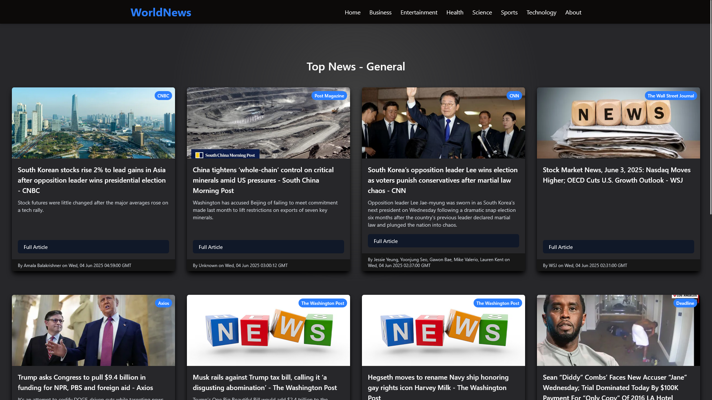
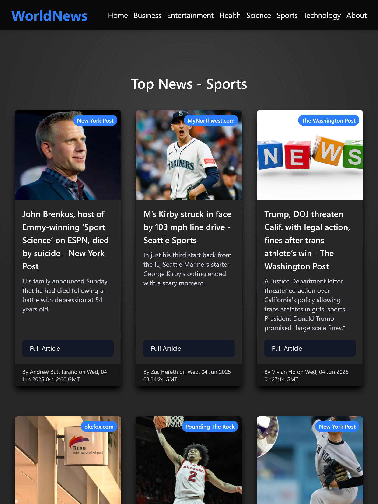
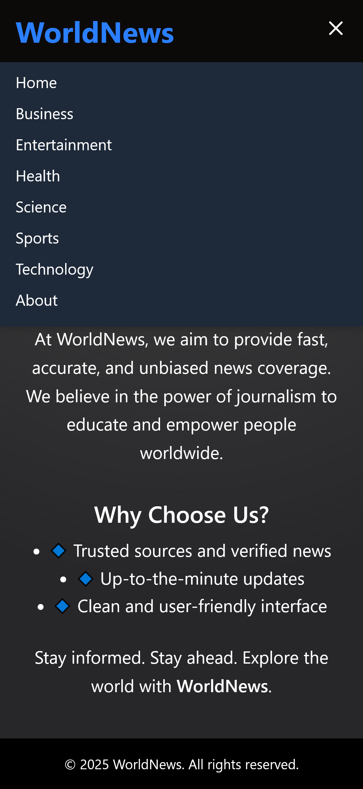

# 📰 Next.js News App

A fast, responsive, and modern **News App** built with **Next.js**, letting users browse news by category using a sleek navbar. Powered by a news API (such as NewsAPI), this app displays the latest headlines with infinite scrolling support and a clean UI.

## 🌟 Features

- 🧭 **Category Navigation** – Easily browse news articles by category (e.g., General, Sports, Technology, Health, Entertainment).
- 🔄 **Infinite Scrolling** – Seamlessly loads more articles as you scroll.
- ⚡ **Fast Rendering** – Built with **Next.js App Router** for optimized performance.
- 📱 **Responsive Design** – Looks great on all screen sizes.

## 🛠 Tech Stack

- ⚛️ **Next.js (App Router)**
- 💅 **Tailwind CSS**
- 📰 **News API**
- ♻️ **React Hooks** for fetching and state management

## 🌍 Try It Live

 [Visit the Live Site](https://newsapp-nu-henna.vercel.app)

## 🔗Demo 


## 📷 Screenshots

### 🖥 Large Screen (Desktop)



### 💻 Medium Screen (Tablet)



### 📱 Small Screen (Mobile)




## 🚀 Getting Started

### 1. Clone the repository

```bash
git clone https://github.com/arijitkayal-gm/newsapp.git
cd newsapp
npm 
```

### 2. Set up Environment Variables

Create a .env.local file in the root directory of the project and add your News API key:

NEWS_API_KEY=your_newsapi_key_here

    🔐 Replace your_newsapi_key_here with your actual API key from https://newsapi.org.

### 3. Run the Development Server

```bash
npm run dev
```

Open your browser and navigate to http://localhost:3000